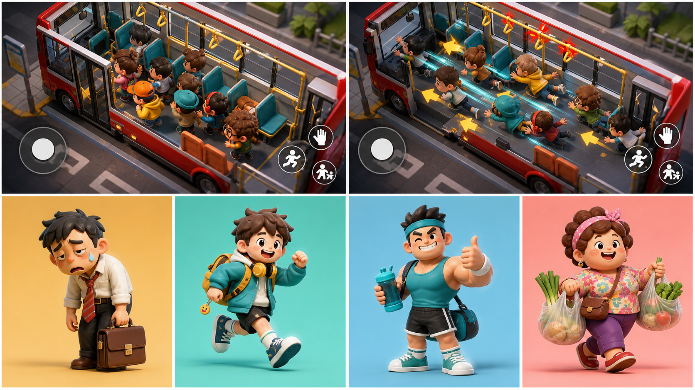
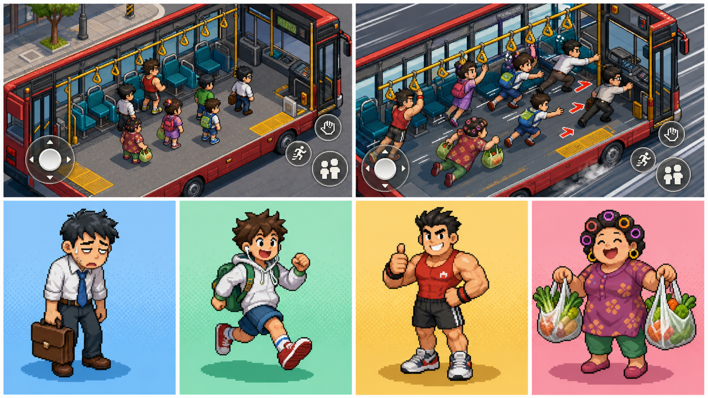
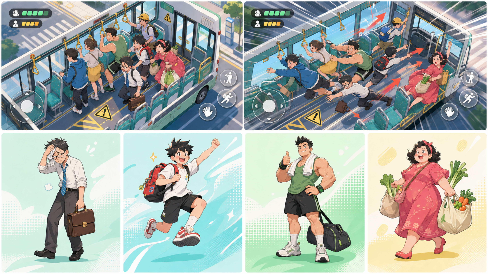

# 美术方向对比

三张概念板使用完全相同的六宫格结构：上排是两张斜 45° 2.5D 实玩画面，下排是打工人、学生、健身哥和买菜阿姨四名角色。它们用于比较风格，不代表最终 UI、模型精度或角色定稿。

## 1. 卡通玩具感

优点：角色体积和推挤动作最有触感，适合制造滑稽碰撞；3D 角色换装、镜头和车厢遮挡也最自然。缺点：模型、骨骼、材质和动画制作成本最高，需要严格控制面数、材质数量和阴影。

适配度：**高**。如果核心卖点是“挤、撞、滑、抓住”的身体喜剧，这是目前最匹配玩法的方向。

## 2. 像素风

优点：轮廓清楚、传播辨识度高，低分辨率素材可以控制贴图体积。缺点：斜 45° 下角色八方向移动、推挤、滑倒、抓扶手和技能都需要大量像素动画；若使用 3D 场景模拟像素风，还要解决像素抖动和缩放一致性，并不天然低成本。

适配度：**中**。适合团队有成熟像素动画能力，或愿意把动作数量显著收缩的情况。

## 3. 清凉漫画风

优点：微信分享图、角色立绘和活动素材表现力强，明亮配色能减轻“拥挤”的压迫感。缺点：概念插画很漂亮，但实时 3D 游戏若要保持同等线稿和赛璐璐质量，需要定制材质、描边和较强的角色美术把控。

适配度：**中高**。适合将游戏内做成简化卡通 3D、结算与宣传图使用漫画插画的混合方案。

## 4. 初步建议

建议优先用“卡通玩具感”完成灰盒后的第一套正式角色，同时吸收“清凉漫画风”的薄荷绿、浅蓝和珊瑚色配色。原因不是它最华丽，而是角色体积、碰撞方向和车厢深度最容易被玩家看懂，和物理推挤的核心体验直接一致。

最终选择前，应用三套低成本占位材质在真实手机上做同一段 30 秒录像，比较：角色遮挡率、危险线可读性、技能预警可读性、低端机帧率和单角色动画工时。只看静态概念图不足以确定游戏美术。

## 5. 生成规格

- 输出：每张 3840×2160 PNG。
- 结构：上排 2 张实玩图，下排 4 张角色图。
- 共同画面：斜 45° 2.5D 公交车、移动摇杆与动作按钮、早高峰、急刹事件。
- 共同角色：打工人小李、学生小夏、健身哥阿强、买菜阿姨兰姐。
- 生成方式：内置图像生成模式；原始生成稿无裁切等比适配至 4K 项目资产。

### 共同提示词

生成一张用于微信小游戏《好挤的大巴》的横向 4K 美术概念板，严格采用六宫格：上排两张等宽的斜 45° 2.5D 真机实玩画面，下排四张等宽的全身角色展示。第一张实玩图表现八名玩家在车厢过道推挤，第二张表现急刹时玩家滑向车头并争抢扶手；清楚显示座位、扶手、前后门、黄色危险区、虚拟摇杆和无文字动作按钮。四名角色依次为疲惫打工人、活力学生、友善健身哥和提菜袋的买菜阿姨。画面必须恰好六格，无标题、标志、水印和可读文字，角色不得重复，保证空间和技能信息易读。

### 三种风格追加词

- 卡通玩具感：高品质 3D 乙烯基玩具质感，圆润比例、彩色塑料材质、柔和棚拍光，红色公交、蓝绿色座椅、明黄扶手。
- 像素风：精致现代像素美术，硬朗像素边缘、统一精灵尺度、丰富像素明暗和瓦片场景，不使用平滑插值或写实 3D。
- 清凉漫画风：清爽通透的现代漫画插画，干净线稿、柔和赛璐璐上色、少量网点，薄荷绿、浅青、珊瑚和柠檬黄，夏日晨光。
